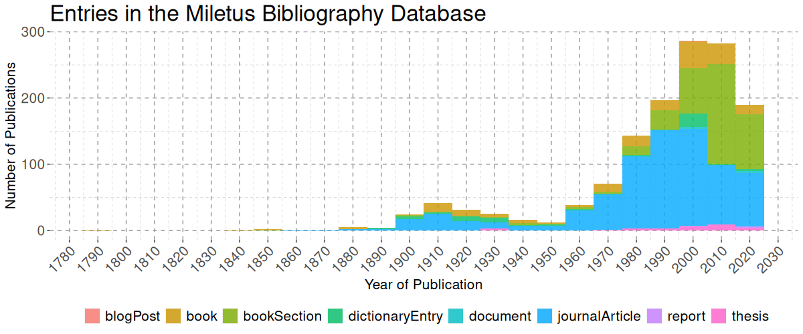

# The Miletus Bibliography	

<!-- badges: start -->

<!-- badges: end -->

# README
This repository contains the code to format the Miletus Bibliography from Zotero-Exports to the formats used on the [Miletus Excavation Website](https://www.miletgrabung.uni-hamburg.de/en/material/bibliographie.html) along with the LaTeX-files used to publish the Bibliography as pdf-files. 

# Updates

All bibliography files and their PDF exports are updated automatically every Monday at 8:00 UTC from the state of the [Zotero group library](https://www.zotero.org/groups/4475959/milet_bibliography) at that time.

# The Miletus Bibliography

The Miletus Bibliography aims to provide a complete overview of the publications of the Miletus excavation as well as those that deal significantly with the ancient polis of Miletus and its history and archaeology.

The bibliography is edited and managed in a [publicly accessible Zotero group library](https://www.zotero.org/groups/4475959/milet_bibliography). By joining the group, anyone has access to a synchronized version of the bibliography via their Zotero client. For those that prefer other literature management software, the website of the Miletus Excavation offers exports of the bibliography in various formats as downloads, namely: [BibLaTeX](https://raw.github.com/lsteinmann/Miletus_Bibliography/main/data/Milet_Bibliography_BibLaTeX.bib), [BibTeX](https://raw.github.com/lsteinmann/Miletus_Bibliography/main/data/Milet_Bibliography_BibTeX.bib), [CSV](https://raw.github.com/lsteinmann/Miletus_Bibliography/main/data/Milet_Bibliography_CSV.csv), [RIS](https://raw.github.com/lsteinmann/Miletus_Bibliography/main/data/Milet_Bibliography_RIS.ris). These should cover the option to import into any literature management software.

A searchable online-version of the bibliography is available on the [homepage of the Miletus Excavation](https://www.miletgrabung.uni-hamburg.de/material/bibliographie.html) as well. It is selectable by keyword, author, year of publication and series or journal. Please note: this list may take few seconds to load. For those who prefer the bibliography in PDF-format, three different versions are provided alongside all the above: 

* [Milet-Bibliographie, by keyword (PDF)](https://raw.github.com/lsteinmann/Miletus_Bibliography/main/out/pdf/milet-bibliographie-by-tag-pdf.pdf)
    This is an export of the Bibliography ordered according to the [System of Keywords](https://www.miletgrabung.uni-hamburg.de/en/material/bibliographie/bib-tags.html).
* [Milet-Bibliographie, chronological (PDF)](https://raw.github.com/lsteinmann/Miletus_Bibliography/main/out/pdf/milet-bibliographie-by-year-pdf.pdf)
    Chronologically ordered, with a section on each year in which publications exist. 
* [Milet-Bibliographie, by author (PDF)](https://raw.github.com/lsteinmann/Miletus_Bibliography/main/out/pdf/milet-bibliographie-by-author-pdf.pdf)
   This version contains a section on each primary or contributing author sorted alphabetically by last name. The section of each author contains all the works this person has contributed to. 

The references in these files are in accordance with the citation guidelines of the [German Archaeological Institute](https://www.dainst.org/publikationen/publizieren-beim-dai/richtlinien). The BibTeX-citation style used for the exports was developed by [Lukas Bossert](http://lukascbossert.github.io/biblatex-archaeologie/). A citation style for Zotero that follows the same rules can be found in the [Zotero Style Repository](https://www.zotero.org/styles) or directly downloaded from there [via this link](https://www.zotero.org/styles/deutsches-archaologisches-institut). 

# History and Contributors
The bibliography has been offered as a [PDF version for download](https://doi.org/10.25592/uhhfdm.8678) for many years by [Sabine Huy](https://orcid.org/0000-0001-7401-3662) in the course of her work at the Miletus Archive at the *Ruhr-Universität Bochum* and later the *Universität Hamburg*. With the collaboration of Caitlin Bamford and Silas Munnecke, the list was converted into a [database version](https://www.zotero.org/groups/4475959/milet_bibliography) as of 2022 and has since been maintained by [Lisa Steinmann](https://orcid.org/0000-0002-2215-1243).

## Context
The scripts and LaTeX-files were produced during my work for the [Miletus Excavation](https://www.miletgrabung.uni-hamburg.de/) in the course of the DFG/ANR-funded project ["Life Forms in the Megapolis: Miletus in the Longue Durée"](https://www.kulturwissenschaften.uni-hamburg.de/ka/forschung/lebensformen-megapolis.html). 
